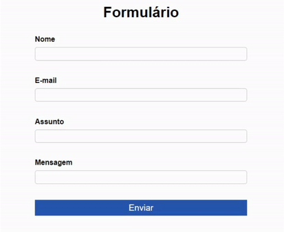

# Formulário com validações

Projeto desenvolvido em HTML,CSS e Java Script. O site desenvolvido é um formulário que possui validações com JavaScript nos campos.

🔗 [Click here to access](https://n4ju15.github.io/formulario/)

## Tecnologias

- HTML
- CSS
- JavaScript
- Git and Github

